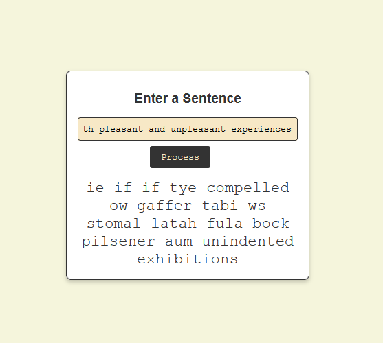

# ScrabbleBabble

[](https://github.com/dvdl16/scrabblebabble/actions/workflows/python-unittest.yml)
[](https://github.com/dvdl16/scrabblebabble/actions/workflows/linters.yml)

A tool to replace each word in a given sentence with another word starting with the same letter that is the same length.

## How do I run this?

### Using the shell

You would need to install [uv](https://docs.astral.sh/uv/), *the extremely fast Python package and project manager, written in Rust*.

**macOS and Linux:**
```shell
# Step 1: Install uv
curl -LsSf https://astral.sh/uv/install.sh | sh 
# The installation script may be inspected before use with `curl -LsSf https://astral.sh/uv/install.sh | less`

# Step 2: Restart your shell or run `source $HOME/.cargo/env`

# Step 3: Clone the repository
git clone https://github.com/dvdl16/scrabblebabble.git

# Step 4: Run the program, with your sentence/words as arguments
uv run main.py hello world
```

**Windows**
```shell
# Step 1: Install uv
powershell -ExecutionPolicy ByPass -c "irm https://astral.sh/uv/install.ps1 | iex"

# Step 2: Restart your shell

# Step 3: Clone the repository
git clone https://github.com/dvdl16/scrabblebabble.git

# Step 4: Run the program, with your sentence/words as arguments
uv run main.py hello world
```

expect an answer like:
```shell
homed walty
```

### Using the local Web UI

Follow the same steps as *Using the shell* above, but run 
```shell
uv run web-ui.py
```
instead.

Open your browser at [http://127.0.0.1:5000/](http://127.0.0.1:5000/) to see:



## Development

`uv ......`

We use[pre-commit](/home/dirk/Projects/Other/scrabblebabble/README.md) to run linting check before committing. First time setup may be required:

```shell
# Install the git hook scripts
pre-commit install

# (optional) Run against all the files
pre-commit run --all-files
```

## Tests

```shell
python -m unittest 
```